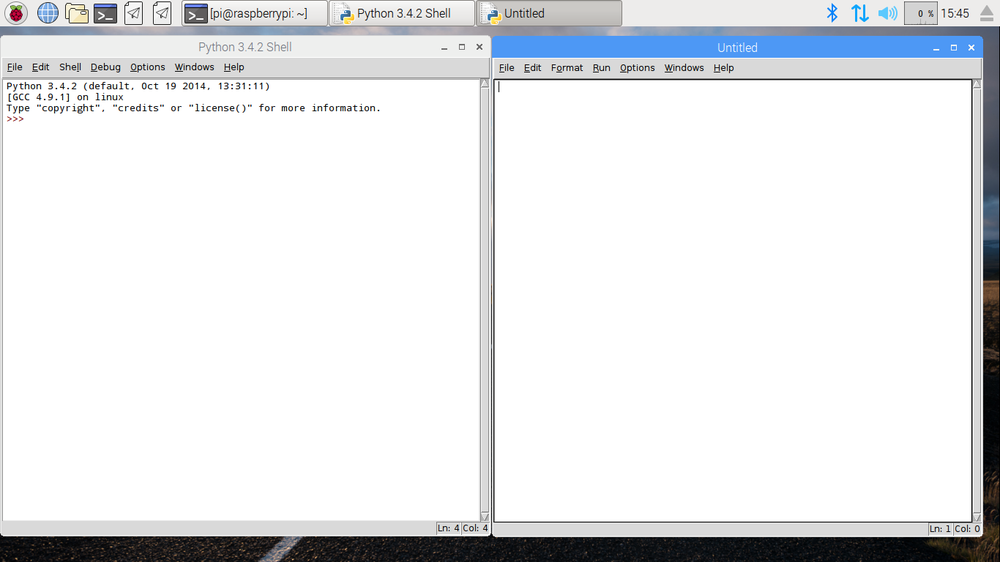

IDLE ist Pythons **I**ntegrated **D**eve**l**opment **E**nvironment (integrierte Entwicklungsumgebung), die du verwenden kannst, um Code zu schreiben und auszuführen.

Um IDLE zu öffnen, gehe zum Menü und wähle `Entwicklung`. Du solltest zwei Versionen von IDLE sehen - bitte klicke auf die Version `Python 3 (IDLE)`.

Um eine neue Datei in IDLE zu erstellen, klicke auf `File` und dann `New File` in der IDLE-Menüleiste. Dies öffnet ein zweites Fenster, in dem du deinen Code schreiben kannst.

