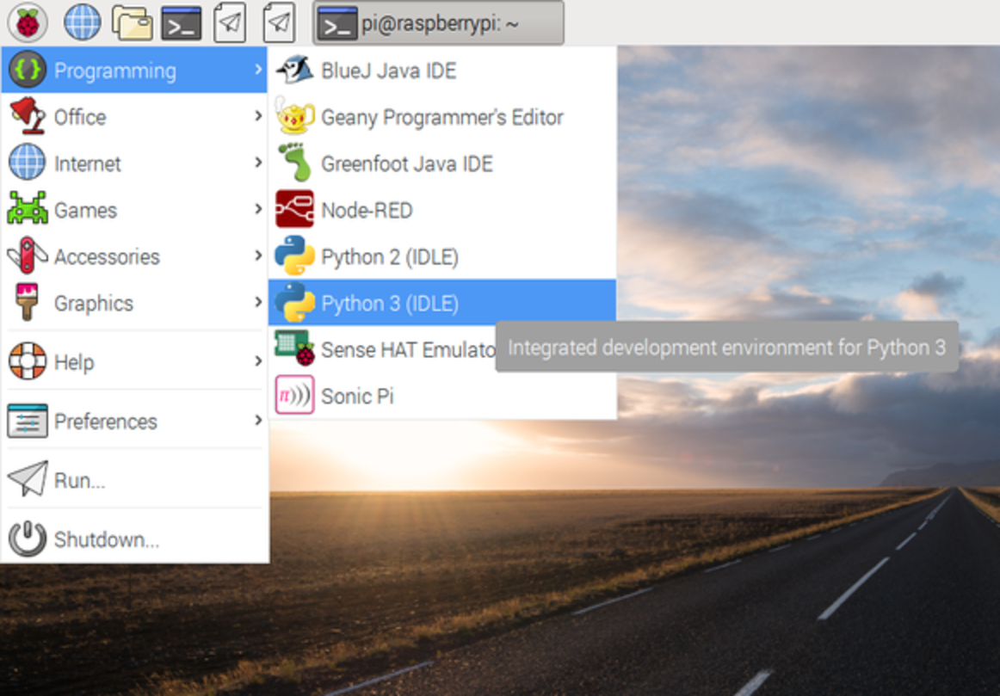
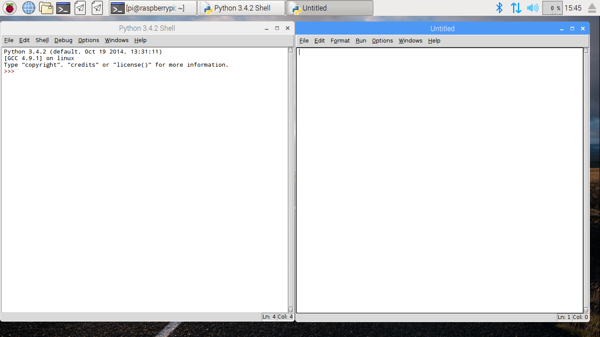

## Opening IDLE for Python 3

IDLE is Python's built in Interactive Development Environment, used to write and run your code.
To open IDLE you can click on the Menu and then find and click the Porgramming section.
You should see two versions of IDLE, so make sure you click on the one that says Python 3 (IDLE).

Once opened to create a new file you can click on `File` and then `New File` in IDLE's menubar.
This will open a second window, in which you can write your code.

