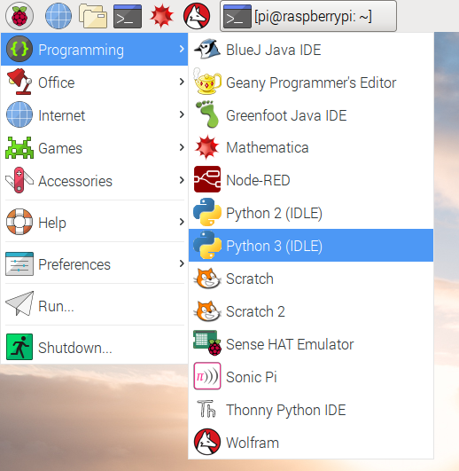
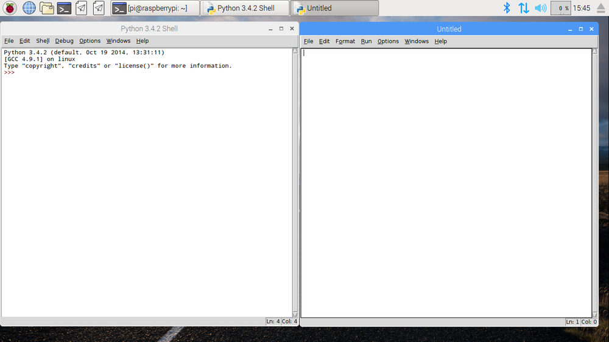

IDLE es el **E**ntorno de **D**esarrollo **I**ntegrado de Python, que puedes usar para escribir y ejecutar código.

Para abrir IDLE, ve al menú y escoge  `Programación`. Verás dos versiones de IDLE - asegúrate de escoger la que dice `Python 3 (IDLE)`.

Para crear un nuevo archivo en IDLE, debes hacer click en `File` y luego `New File` en el menú de IDLE. Esto abrirá una segunda ventana en la cual puedes escribir tu código.

