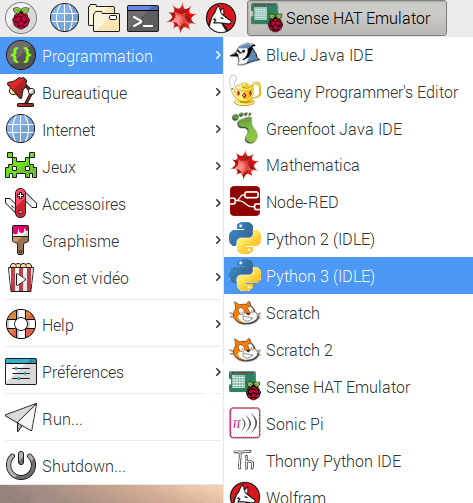

IDLE est un **E**nvironnement de **D**éveloppement **I**ntégré, que tu peux utiliser pour écrire et exécuter du code.

Pour ouvrir IDLE, va dans le menu et choisis `Programmation`. Tu devrais voir deux versions de IDLE - assure-toi de cliquer sur celle qui dit `Python 3 (IDLE)`.

Pour créer un nouveau fichier dans IDLE, tu peux cliquer sur `Fichier` puis `Nouveau fichier` dans la barre de menu de IDLE. Cela ouvrira une seconde fenêtre dans laquelle tu peux écrire ton code.

