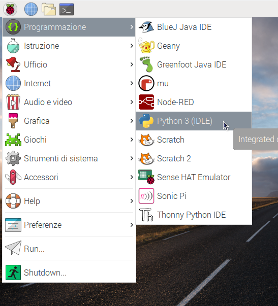
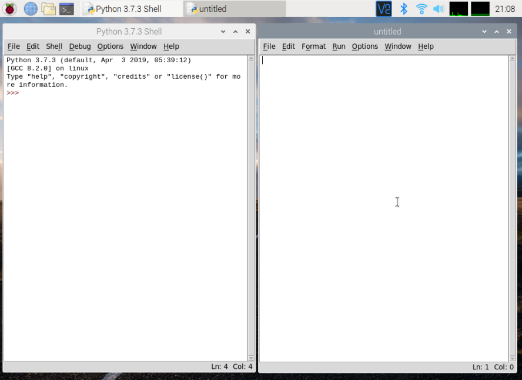

IDLE significa Python **I**ntegrated **D**eve**l**opment **E**nvironment, e lo puoi usare per scrivere ed eseguire codice.

Per avviare IDLE, vai al menu di avvio e scegli `Programmazione`. Dovresti vedere due versioni di IDLE - assicurati di fare clic sulla `Python 3 (IDLE)`.

Per creare un nuovo file in IDLE, è possibile fare clic su `File` e quindi `Nuovo file` nella barra dei menu di IDLE. Questo aprirà una seconda finestra in cui potrai scrivere il tuo codice.

