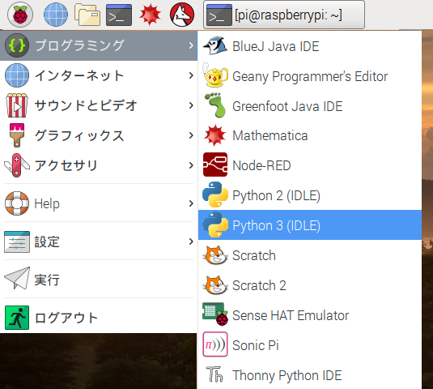

IDLEはPythonの統合開発環境（**I**ntegrated **D**eve**l**opment **E**nvironment）で、コードを書いたり実行したりするのに使うことができます。

IDLEを開くには、メニューから`プログラミング`を選びます。 2つのバージョンのIDLEが表示されるので、 `Python 3 (IDLE)`と書かれているバージョンをクリックしてください。

IDLEで新しいファイルを作成するには、IDLEのメニューバーにある`File`（ファイル）をクリックし、`New File`（新しいファイル）をクリックします。 こうすることでコードが書ける2番目のウィンドウが開きます。

