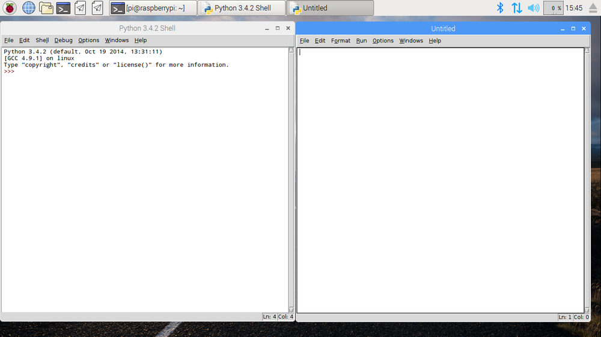

IDLE is de **I**ntegrated **D**eve**l**opment **E**nvironment van Python, waarmee je code kunt schrijven en uitvoeren.

Om IDLE te openen, ga naar het menu en kies `Programmeren`. Je zou één of twee versies van IDLE moeten zien - zorg ervoor dat je klikt op degene die `Python 3 (IDLE)`zegt.

Om een nieuw bestand in IDLE te maken, klik je op `File` en vervolgens op `New File` in de menubalk van IDLE. Dit opent een tweede venster waarin je je code kunt schrijven.

