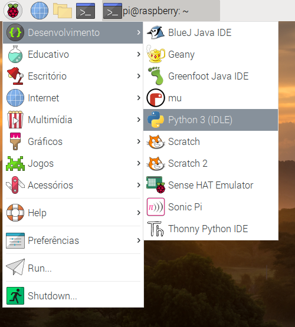

IDLE é o ambiente de desenvolvimento integrado do Python (que vem do inglês **I**ntegrated **D**eve**l**opment **E**nvironment), que você pode usar para escrever e executar código.

Para abrir o IDLE, vá ao menu e escolha `Desenvolvimento`. Você deve ver duas versões do IDLE - certifique-se de clicar na versão que diz `Python 3 (IDLE)`.

Para criar um novo arquivo no IDLE, você pode clicar em `File` e depois em `New File` na barra de menu do IDLE. Isso abrirá uma segunda janela na qual você pode escrever seu código.

